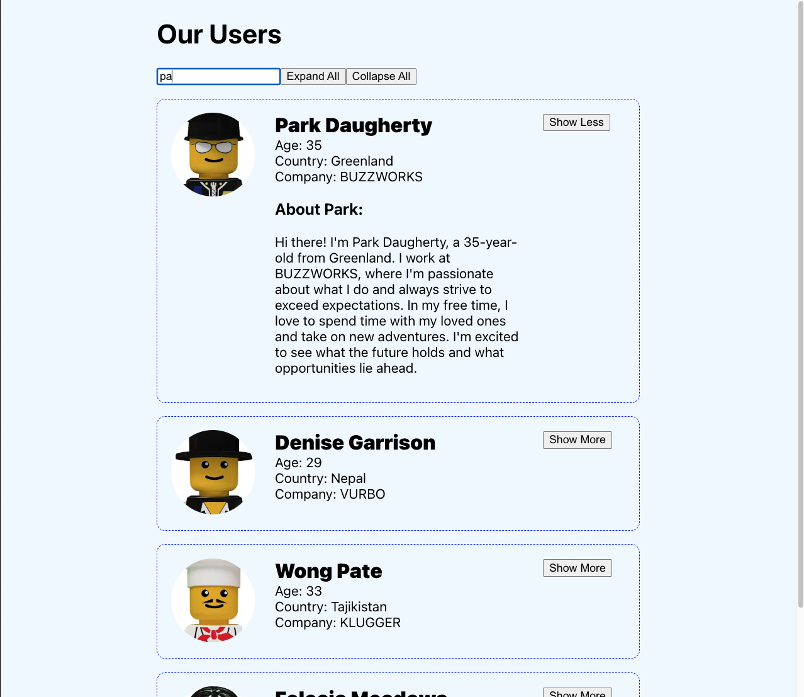

# Users App Practice Assessment

## Introduction

This project is part of a practice assessment to build a Users app. The app interacts with an external API to fetch user data and display it to users.

## Getting Started

1. Fork and clone this repository.
2. Navigate to the project directory: `cd users-app-practice`.
3. Install project dependencies: `npm install`.
4. Start the app: `npm start`.

## Usage

Once the app is started, users can access it in their browser. The app fetches user data from an external API and presents it in a user-friendly format.

## Fetching Data

The app fetches user data from the external API at: https://users-app-backend.onrender.com/users. The fetched data is used to populate the app's interface, allowing users to view user profiles.

## Screenshots

## Contributing

We welcome contributions to improve the app. If you'd like to contribute, please follow our guidelines for creating issues and submitting pull requests.

